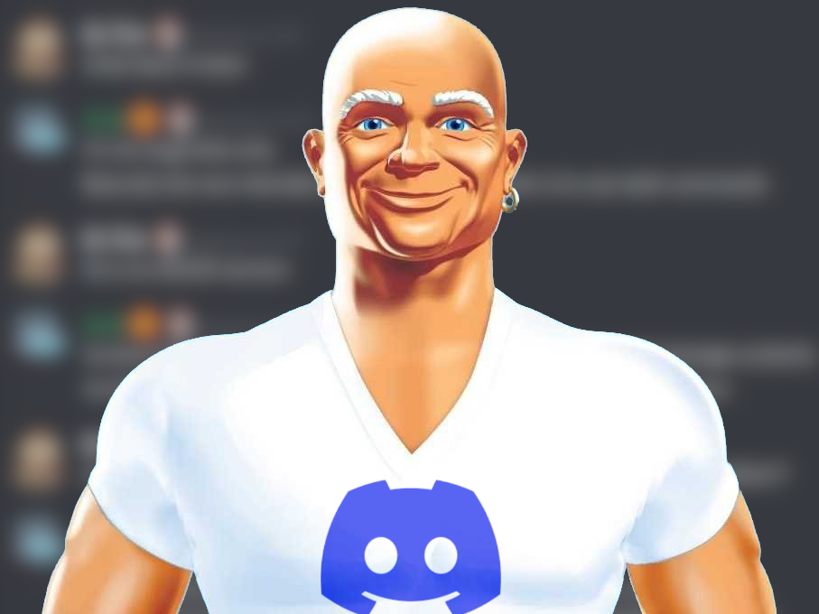

# Mr. Clean bot

An alternative to the CleanChat, that will be shutting down soon.

## How to build and run this bot

# Prerequisities
- Install git
- Install .NET Core 6 SDK by following instructions on this [site](https://dotnet.microsoft.com/en-us/download).
- Validate your installation by running `dotnet --info`
- Obtain a valid bot token at [https://discord.com/developers/applications](https://discord.com/developers/application)

# Configuration

There are two possible ways for configuring the bot. You can use either production configuration file or environmental variables.

## Configuring the bot by using a configuration file

- Copy the `appsettings.json` file into `appsettings.Production.json`
- Edit `Discord.Token`, `Discord.GuildId` and `ConnectionStrings.Default` variables (and others if needed)
- Start the application by running `dotnet run --project MrClean --launch-profile Production`

## Configuring the bot by using environmental variables

- Configure the `DISCORD__TOKEN`, `DISCORD__GUILDID` and `CONNECTIONSTRINGS__DEFAULT` environemental variables
- This can be done by running:
```bash
export DISCORD_TOKEN="token"
export DISCORD_GUILDID=12345
export CONNECTIONSTRINGS_DEFAULT="connection string"
```

- Finally set the `DOTNET_ENVIRONMENT` env variable to `"Production"`
- Start the application by running `dotnet run --project MrClean`


